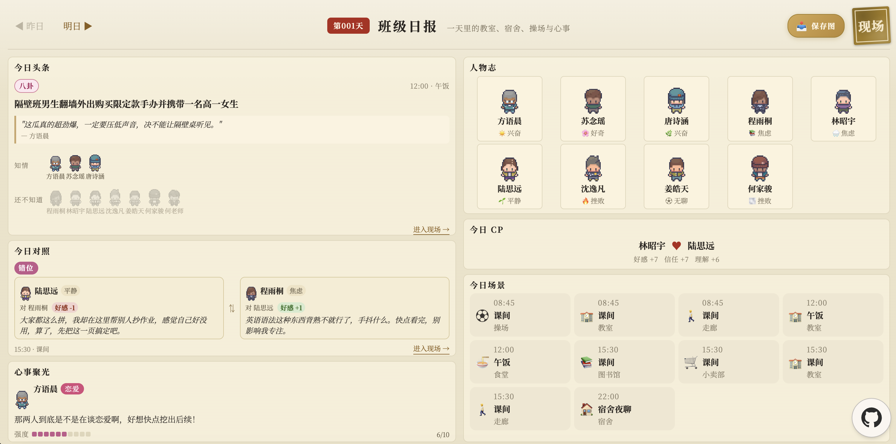
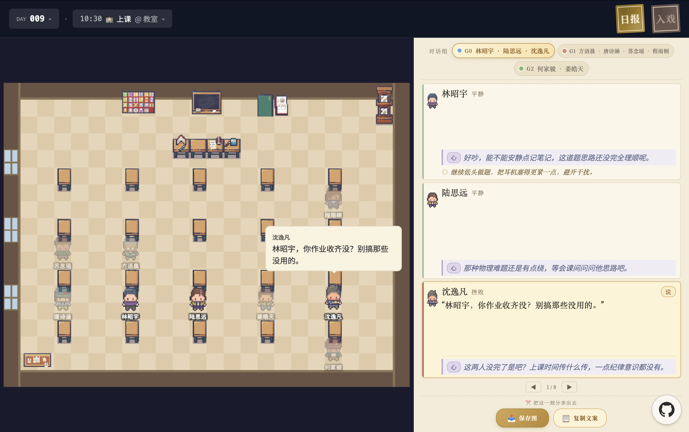

# SimCampus

**[在线 Demo](https://www.simcampus.top/)** · [English](README.md) · [MIT License](LICENSE)

一个多 agent LLM 模拟引擎。定义一群角色——各自有性格、目标、心事、相互关系——再加一张每天的场景时刻表，引擎按天推进，自动生成对话、记忆和叙事线，不需要任何手写剧本。




---

## 目录

- [这是什么](#这是什么)
- [快速开始](#快速开始)
- [换角色](#换角色)

---

## 这是什么

每个角色是一个独立的 agent，包含：

- **Profile** — 性格、背景、目标、行为锚点，模拟过程中不可变
- **State** — 情绪、能量，最多 4 个活跃心事（各带 1–10 的 intensity 和 TTL）
- **Memory** — 按重要性排的最多 10 条 key memories、每隔几天刷新一次的自叙事、滚动的近期流水
- **Relationships** — 和其他所有 agent 的关系，量化成 favorability / trust / understanding

跑一天就是把当天时刻表里的每个场景跑一遍。场景里 agent 做感知、思考、说话、行动；场景结束后总结、写记忆、更新关系和心事。所有存储是平面 JSON + Markdown，没有数据库，任何文件都可以直接 `cat` 看。

**为什么值得看：**

- **有心智的 agent** — 对话不是随机聊天，是由心事和意图驱动的，agent 会主动引用几天前发生的事。
- **可配置的每日循环** — 时刻表、场景密度、分组规则、free period 都在 `canon/worldbook/schedule.json` 里。
- **涌现叙事** — 跑足够多天之后自然长出多日剧情线：流言流传、对立形成、联盟转变。
- **整班可替换** — 编辑 `canon/cast/profiles/*.json` 换成任何你想要的设定。

## 快速开始

### A. 直接看已跑好的 demo（不用 API key）

仓库里自带一份 9 天预跑数据，已经导出到前端。前置：Node 18+ 和 [pnpm](https://pnpm.io/)。

```bash
cd web
pnpm install
pnpm dev # → http://localhost:5173
```

浏览器打开链接，点着玩——班级日报、像素世界、角色档案、关系图。


### B. 跑你自己的模拟

> 想用自己的角色搭一个高中？先去 [换角色](#换角色) 编辑角色 profile。

前置：Python 3.12+（用 [uv](https://docs.astral.sh/uv/)）、Node 18+ 和 [pnpm](https://pnpm.io/)，再加一个 LLM provider 的 API key。默认走 **OpenRouter**（主模型 Gemini 3.1 Flash Lite，便宜稳定），也支持 DeepSeek / OpenAI / Anthropic（通过 LiteLLM）。

> **注意**：下面第 2 步会清空 `simulation/state|world|days`——包括自带的 demo 数据。

```bash
# 1. 安装 Python 依赖
uv sync

# 2. 配置 LLM API key
cp .env.example .env
# 编辑 .env，填入 OPENROUTER_API_KEY（或切换到其他 provider，见 .env.example 注释 + src/sim/config.py）

# 3. 初始化世界
uv run python scripts/init_world.py

# 4. 跑 5 天
uv run sim --days 5

# 5. 启动 API server——前端的 Role Play / God Mode 聊天需要。
# 另开一个 terminal 跑。
uv run api                           # → http://localhost:8000

# 6. 导出到前端 + 查看
uv run python scripts/export_frontend_data.py
cd web && pnpm install && pnpm dev   # → http://localhost:5173
```


## 换角色

编辑 `canon/cast/profiles/*.json` 即可，一个文件一个角色。

### 硬约束

**不要增删或重命名 `agent_id`**。槽位数量和身份在以下文件里是硬编码的：

- `scripts/init_world.py` → `PRESET_RELATIONSHIPS`
- `src/sim/world/scene_generator.py` → 位置和分组逻辑
- `src/sim/interaction/orchestrator.py` → 特殊角色 hook
- `src/sim/world/homeroom_teacher.py` → 特殊角色逻辑

**替换每个槽位的内容，不要动槽位本身。** 如果真的要增删角色，要协同改上述文件——out of scope。

### 方式一：手动编辑

1. 打开 `canon/cast/profiles/<id>.json`，按 `src/sim/models/agent.py` 里 `AgentProfile` 的 schema 改
2. 验证 JSON 和 Pydantic：
   ```bash
   python -m json.tool canon/cast/profiles/<id>.json > /dev/null
   uv run python -c "from src.sim.models.agent import AgentProfile; AgentProfile.model_validate_json(open('canon/cast/profiles/<id>.json').read())"
   ```
3. 如果改了角色间的关系，同步 `scripts/init_world.py` 里的 `PRESET_RELATIONSHIPS`
4. 重建世界（**会清空 `simulation/state|world|days`**，包括所有历史 run）：
   ```bash
   uv run python scripts/init_world.py
   uv run sim --days 5
   ```

### 方式二：让 AI 帮你换（推荐）

把下面这句丢给 Claude Code / Cursor / Codex：

> 我想用这个项目模拟我自己的场景。请按照 `skills/build-cast.md` 的流程，带我一步步编辑角色。

AI 会读 schema、一批批问字段、帮你打磨 backstory、验证 JSON、更新关系表，最后告诉你接下来跑什么。整个 session 大概 30–60 分钟换完一整套。
